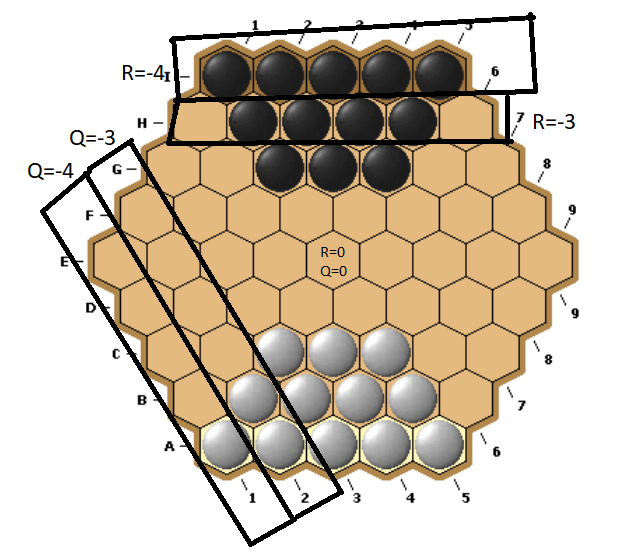
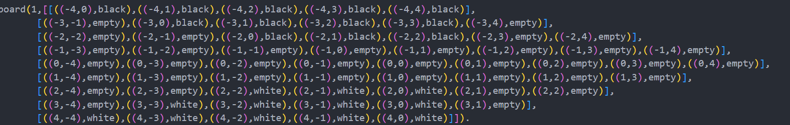
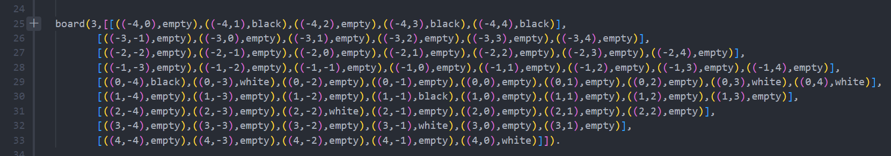
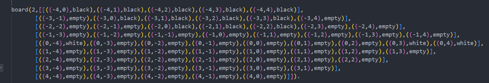

# Taacoca

Developed by G02_02: 
- Pedro Manuel da Silva Gomes (up202006322@edu.fe.up.pt)
- João Rola Reis (up202007227@edu.fe.up.pt)

## Installation and Execution
- Install SICStus Prolog 4.7.1
- consult game.pl
- the main predicate play/0 gives access to the game menu

## Description of the game

[Game documentation](https://www.iggamecenter.com/en/rules/taacoca)

Tacaaoca is a board game that's played in a hexagonal board. The main objective is to reach the oppenet's Home row. For the black pieces de home row is the top line of the board, for the white pieces the home row is the bottom line of the board. Beside that you can win the game by capturing all the opponent pieces. For moving the pieces the player has to select 3 pieces and move them all in the same direction, if the player can't move the remaining pieces in the same direction he loses the game. If a player has less that 3 pieces he has to move all his remaining pieces. For capturing opponent pieces the player has to move the pieces in the way that the target cells are occupied by a opponent's piece.

## Game Logic

### Internal representation of the state of the game

Since our game is based on an hexagonal grid, we cannot use regular coordinate systems. After some [research](https://www.redblobgames.com/grids/hexagons/), we decided that the best coordinate system to represent an hexagonal grid is the axial coordinate system.

If we take a cube grid and slice out a diagonal at q + r + s = 0, there is an elegant symmetry that allows for easy manipulation of positions on the grid.

The coordinates given by (q,r,s) correspond to cube coordinates.

Since q + r + s = 0, we can calculate s = -q-r (if we needed it, which we don't in this project). Because of this, we can represent a position on the grid using only q and r.

We can think of r as being a row and q as being a "column", except this column is a diagonal and grows in the North-East direction.

We store the game state using a matrix (each of the matrix lines corresponds to every hexagon with the same R). Each entry in the matrix is of the type ((R,Q),Piece), where R and Q are the axial coordinates of some hexagon in the grid and Piece is the piece (white,black or empty) in that hexagon. white corresponds to a white stone (and also to the person who is playing with the white stones), black corresponds to a black stone (and also to the person playing with the black stones) and empty represents an empty hexagon.

Here is an example of the initial game state (when the hexagon has sides of 5, corresponding to the original game of Taacoca).

This corresponds to the board 1 in board.pl

Here is an example of the intermediate game state (when the hexagon has sides of 5, corresponding to the original game of Taacoca).

This corresponds to the board 3 in board.pl

Here is an example of the initial game state (when the hexagon has sides of 5, corresponding to the original game of Taacoca).

This corresponds to the board 2 in board.pl

### Visualization of the Game State

The player starts the game by choosing the type and difficulty of game that he wants to play. Then he chooses the size of the board, in our case the number of hexagons that each side of the board has. We only let the user choose the size between 3 and 13, beacause it only makes sense to play with at least 3 pieces in the start of the game beacause you should move 3 pieces per move, and 13 because the alphabet only has 26 letters and we need the letters to indicate the lines of the board. Than we initialize the board using the initial_state predicate. 
To display the game we use the display_game predicate. We first display the numbers of the top of the board that represents the coordinates that the player uses to indify the piece that he wants to move. Then we display the board line by line. To display a line we first print the top of the hexagons ('/ \\'), then we print the letter that represents the line, that will be used by the player to indicate the line of the the piece that he wants to move. Then we display the mid section of the hexagons ('| x |', where x is 'b' if there is a black piece, 'w' if there is a white piece, ' ' if there is no piece in that hexagon). Then we display the numbers that the player will use the identify the piece that he wants to move. Finally, we print the bottom of the hexagons (''\\ /'). After printing the board, we print the numbers of the bottom of the board that represents the coordinates that the player uses to indify the piece that he wants to move.

### Moves Execution

First, we get the type of player who is currently playing (human or computer) with the get_type_of_player predicate. After that, we use the choose_move predicate to choose a move (3 stones or less if the player doesn't have 3 stones in the board and a direction).
If the player is a human, the predicate does this by asking for the position of 3 hexagons in the coordinate system given in the Taacoca documentation (e.g. ('A',1)), parse thes coordinates to axial coordinates and calculate the possible directions (also in axial coordinates) in which those stones can move and asking the user to choose one of these directions. 
In order for a move to be valid, it needs to satisfy certain conditions:
- the new position has to be in the board
- there isn't a stone of the same team on any of the positions to which the stones moved, unless that stone in that position is one of the stones moving

We present the directions in a human-friendly way (i.e. the ones present in a compass card (e.g. 'NE','S',etc)) and parse the chosen direction to axial coordinates. We need to parse everything to axial coordinates because the move predicate is expecting to receive positions and directions in those coordinates.

We took advantage of backtracking to easily repeat the process of choosing a stone or a direction when one of the choices isn't valid.

This can happen if:
- The player chooses a position that isn't on the board or isn't one of it's stones
- The player chooses the same stone twice
- The player chooses a combination of stones that have no directions in which they can move
- The player chooses a direction that doesn't exist or in which the chosen stones can't move

If the player is a computer, it calculates all the possible moves and chooses one of them.

After having the (up to) 3 stones and a direction in axial coordinates, we use the move predicate to get the new game state. We do this by recursively calling the moveStone predicate for every Stone in the list, setting the current position of each chosen stone to empty and setting the position of each stone after making the move to the current player's stone. However, since stones can move to the old positions of another stone that moved in the same play, we can't set the current position of a stone to empty if that position corresponds the new position of another stone.

### List of Valid Moves

To list all the valid moves the predicate valid_moves uses the findall function that returns every result of the choose_stones predicate. The choose_stones chooses 3 pieces (2 or less if the player has less then 3 pieces in the board), calculates the possible directions for these 3 pieces and chooses one of them, returning the pieces and the direction. 

### End of Game

To check if the game is over the game_over predicate checks if there is valid moves that the opponent can do by using  the valid_moves predicate. If the player opponent has valid moves, checks if the player has reached the opponent home row. This is done by using the black_reach_opponent_home predicate if the player is the black pieces, or the white_reach_opponent_home predicate if the player is the white pieces.
If the game has in fact ended, the congratulate predicated is used to print a message congratulating the winner.

### Board Evaluation
To evaluate a game state for a certain player, we calculate the square root of the minimum number of moves each stone has to make to reach the opponent's home row and then calculate the average of the resulting list (DistanceToWin). We do the same for the average number of moves the opponent has to make to reach our home row (DistanceToLose). 

We also calculate the number of opponent stones in the board (NrEnemyStones). We thought of also using the number of ally stones, but since the value predicate is being used to compare moves and all possible moves always have the same number of ally stones (since we can't lose stones when when it's our turn no matter the move we make), we decided not to use that variable. 

Using these 3 variables, we use the following formula: 

$(DistanceToWin-DistanceToLose+NrEnemyStones)$

Since we are ordering all possible moves by value and selecting the one with the smallest value, the smaller the result of the formula, the better that move is.

Since we are adding DistanceToWin, the bigger the distance we need to win the bigger the value, hence less worth the move. The reason we apply the square root function to the number of moves to win for each stone is because the square root function always grows but it grows increasingly less (first derivative is positive, second derivative is negative for every positive value it is applied to). Because of this, moving closer to the opponent's home row is better (since the square root always grows) but is also better the closer we are to the opponent's home row (e.g. it's better to move a stone 2 moves away from reaching the opponent's home row to a position 1 move away then a stone 7 moves a way to a position 6 moves away), since the square root grows increasingly less (sqrt(2)-sqrt(1)>sqrt(7)-sqrt(6)), due to the second derivative always being negative.

Since we are subtracting DistanceToLose, the smaller the distance the enemy needs to win the bigger the value, hence worth the move. Because of this, if a move results in capturing enemy stones close to our home row, it will result in a bigger DistanceToLose when compared to moves that don't (since we used the square root function), resulting in a smaller value for those type of moves and them being chosen.

Since we are adding NrEnemyStones, the more stones the enemy has the bigger the value hence worse the move. This results in moves in which we capture enemy stones being better than moves in which we don't.

### Computer move